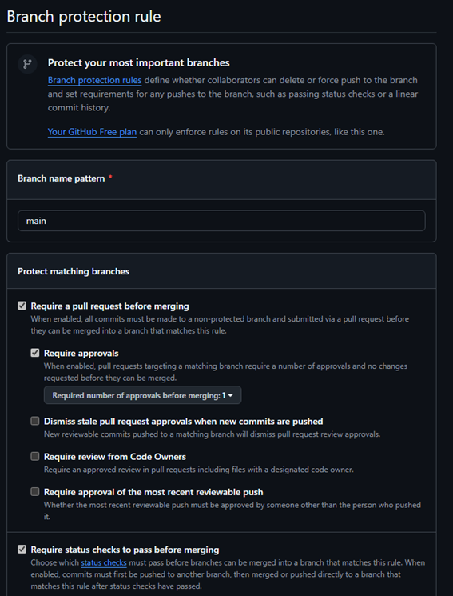

# 1. Desarrollo de un Sistema de Gestión de Ventas para TechZone 🛒

## 1.1. Problematica ⚠️
### Salón Encanto, dedicado al alquiler de espacios para eventos, actualmente gestiona las reservas de forma manual, lo que ha generado diversos problemas como errores de sobre-reserva, dificultad para visualizar la disponibilidad en tiempo real y falta de seguimiento a las solicitudes de los clientes. Esta situación reduce la eficiencia operativa, limita la capacidad de respuesta ante imprevistos y afecta negativamente la experiencia del usuario.
### La ausencia de una solución tecnológica genera retrasos en la atención, pérdida de oportunidades comerciales y sobrecarga administrativa. En un entorno donde la digitalización es esencial para competir y brindar un servicio profesional, se hace evidente la necesidad de contar con una plataforma web automatizada que permita mejorar la gestión y brindar mayor comodidad tanto a los usuarios como al personal del negocio.

## 1.2. Objetivos 🎯
### 1.2.1. Objetivo General
#### Desarrollar e implementar una plataforma web intuitiva y automatizada que permita a los usuarios reservar espacios y eventos de Salón Encanto de manera sencilla, rápida y sin errores, optimizando a su vez la gestión interna.

### 1.2.2 Objetivos Especificos. 
* Crear un calendario interactivo con disponibilidad en tiempo real.
* Incorporar notificaciones automáticas para mantener informados a los usuarios.
* Facilitar un panel de administración para el personal de Salón Encanto.
* Obtener métricas clave que permitan analizar el rendimiento del sistema.

## 1.3. Requerimientos 📜
|Funcionales|No Funcionales|
|-----------|--------------|
|Calendario visual con horarios disponibles.|Plataforma web responsive (compatible con PC, tablet y móvil).|
|Motor de reservas en tiempo real.|El README tendra todo el proceso de desarrollo|
|Sistema de notificaciones (email y/o móvil).|Rendimiento eficiente (respuestas rápidas al reservar o consultar disponibilidad).|
|Panel de gestión para administradores.|Seguridad de datos (protección de información de usuarios y reservas).|
|Base de datos para usuarios, reservas, espacios y reportes.|Disponibilidad y confiabilidad (el sistema debe estar operativo la mayor parte del tiempo).|
|Módulo para encuestas de satisfacción.|Escalabilidad (permitir futuras funcionalidades y expansión a más espacios o filiales).|

## 1.4. Gestión de incidencias
### Proceso de identificar, registrar, analizar y resolver problemas o fallas que ocurren en un sistema o proyecto.
### Objetivo: Minimizar el impacto de los errores, asegurar la continuidad del servicio y mantener un registro histórico de los problemas.

### Elementos clave:

* Registro de incidencias (issues)

* Asignación y seguimiento

* Resolución y cierre

* Reportes y análisis de tendencias

### Casos: Un usuario reporta que no puede completar un pago; se registra la incidencia, se asigna al desarrollador, se corrige y se cierra el issue.

## 1.5. Integración Continua (CI)

### Práctica de desarrollo en la que los cambios en el código se fusionan frecuentemente en un repositorio central, ejecutando automáticamente compilaciones y pruebas para detectar errores lo antes posible.

### Objetivo: Garantizar que el código sea funcional y estable en todo momento, evitando que los errores se propaguen a la rama principal.

### Elementos clave:

* Compilación automática del proyecto

* Ejecución de pruebas unitarias y de integración

* Validación de calidad del código

* Notificaciones de fallos a los desarrolladores

### Casos: Cada vez que un desarrollador sube código, GitHub Actions ejecuta tests y construye el proyecto automáticamente.

## 1.6. Entrega Continua (CD)

### Extensión de la integración continua que permite desplegar automáticamente el software a un entorno de pruebas o producción después de que pasa los tests de CI.

### Objetivo: Reducir el tiempo y los errores asociados al despliegue manual, garantizando que nuevas funciones o correcciones estén disponibles rápidamente.

### Elementos clave:

* Despliegue automático a un entorno de pruebas o producción

* Validación post-despliegue

* Monitoreo y notificaciones

### Casos: Una vez que CI confirma que el build es correcto, el sistema se despliega automáticamente al servidor de pruebas para que el equipo lo verifique.

## 1.7. Creación de la carpeta para la gestión de incidencias:

## 1.8. Creación de labels.yml automatizado: 

## 1.9. Corrección de labels en GitHub si no funciona:


# Ejemplo de funcionamiento:
## 1.10. Nuevas etiquetas de prueba:

## 1.11. Creación de Issues automatizados con la organización: 

## 1.12. Realizando el despliegue:


<!--
## 1.4. Tecnologias utilizadas 💻
* JavaScript/MySQL/css.
* Git/GitHub.
* Visual Studio Code

## 1.5. Instalacion y Ejecucion ▶️
```bash
git clone "enlace URL del remote"
```


## 1.6. Roles y Creditos 👥
|N°|Nombre|Rol|Funciones|
|--|------|---|---------|
|1|Luciano|Git Master|Control de Versiones|
|2|Peter|Dev Backend|Implementacion de APIs|
|3|Sheroo|Dev Frontend|Diseño con CSS|
# 2. Flujo de trabajo GIT
## 2.1. Configuración de identidad
### Comandos
```bash
git config --global user.name "Tu Nombre"
```
```bash
git config --global user.email "tuemail@example.com" 
```


## 2.2. Verificar que la carpeta este creada


## 2.3. Abriendo proyecto desde GitBash
### Crear carpeta del proyecto
```bash
mkdir "Nombre del Proyecto"
```
### Entrar a la carpeta
```bash
cd "Nombre de la carpeta"
```


## 2.4. Inicializando GIT en la carpeta “Proyecto_HDW”
```bash
git init
```


## 2.5. Primer archivo “README.md” referido al primer commit
### Para ingresar texto (echo "") y sea dirigido (>) a README.md
```bash
echo "# TEXTO" > README.md
```
### Agregar el archivo (add.)
```bash
git add. "indica que se agregara"
```
### Realizar el COMMIT
```bash
git commit -m "como se llamara el commit"
```


## 2.6. Agregando “LICENSE” y “.gitignore”
### Agregar LICENSE
```bash
touch LICENSE
```
### Agregar .gitignore
```bash 
touch .gitignore
```
### Verificar si esta o no agregado (add.)
```bash
git status
```


## 2.7. Repositorio local GIT al remoto GitHub
### Conectar al remoto
```bash
git remote add origin "URL del repositorio"
```
### Verificar el vinculo del repositorio
```bash
git remote -v
```


## 2.8. Clases y su commit
### Ver el estado
```bash
git status
```
### Agregar
```bash
git add .
```
### Realizar el segundo COMMIT
```bash
git commit -m "como se llama el commit"
```


## 2.9. Ramas en Git a GitHub
### Crear rama
```bash
git checkout -b "Nombre de la rama"
```
### Volver a la rama principal
```bash
git git switch main
```


### Verificar ramas creadas 
```bash
git branch
```
### Subir ramas a GitHub
```bash
git push --all origin
```


## 2.10. Auditar archivos
### Lista de archivos del proyecto
```bash
git ls-files
```


## 2.11. Viendo commits  y el ID de commits
### ver commit
```bash
git log --oneline
```
### Ver detalle de commit
```bash
git show <ID de commit>
```


## 2.12. Primera version
### Subir al remoto
```bash
git push origin "nombre de la rama"
```
### Subir la version
```bash
git tag -a "numero de version" -m "nombre del commit"
```
### Subir la version
```bash
git push origin "numero de version"
```


## 2.13. Compare & pull request


## 2.14. Ramas fucionada y no fucionadas
### Fucionar ramas
```bash
git pull origin main
```

### Validando ramas 
```bash
git branch --no-merged
```
```bash
git branch --merged
```


## 2.15. Limpiando main para que solo quede LICENSE, README.md y .gitignore
### Guardando todo el código en la rama “backup”
```bash
git push origin backup
```


### Borrando todos los archivos preservando LICENSE, README.md y .gitignore
```bash
git rm -r --cached *
```
```bash
git reset HEAD LICENSE READNME.md .gitignore
```


### Commit y push al GitHub


## 2.16. Eliminando archivos duplicados en otra rama

### Confirmando la eliminacion de los archivos y realizando su commit
```bash
git add -u
```


## 2.17. Conflicto


### Creando archivos para generar conflicto
```bash
git add "archivo"
```
```bash
git commit -m "nombre para commit"
```

### Se visualiza el conflicto


### Solucion de conflicto

### Eliminando rama de prueba para conflicto


## 2.17. Versiones actuales


# 3. Trabajo colaborativo en GitHub
## 3.1. Conectar el repositorio con el GitHub


## 3.2. Creacion de archivos CHANGELOG.md y CONTRIBUTING.md


## 3.3. Configuracion de Branch Rules y Tag Rules
* Protege main (para que solo tú puedas fusionar).
* Exige aprobación de al menos 1 revisor antes de hacer merge.


## 3.3. Regla de protección de sucursales



## 3.4. Agregando los Tag 


## 3.5. Prueba de reglas para el correcto funcionamiento.


## 3.6. Creacion de Issues 


## 3.7. Gestion de Issues y Milestones


## 3.8. Asignación de trabajo y prioridad


## 3.9. Creación de Milestones


## 3.10. Agregando Issues a Milestones


## 3.11. Revisar archivos modificados (Líder de grupo)


## 3.12. Creación del fork


## 3.13. Vista del fork creado


## 3.14. Clonamos


## 3.15. Agregamos nuestro aporte


## 3.16. Se realiza el commit y el push


## 3.17. Se realiza un PR


# 4. Capturas de Pantallas
## 4.1. Pagina Inicio


## 4.2. Pagina Producto


## 4.3. Pagina Nosotros


## 4.4. Pagina Contacto
