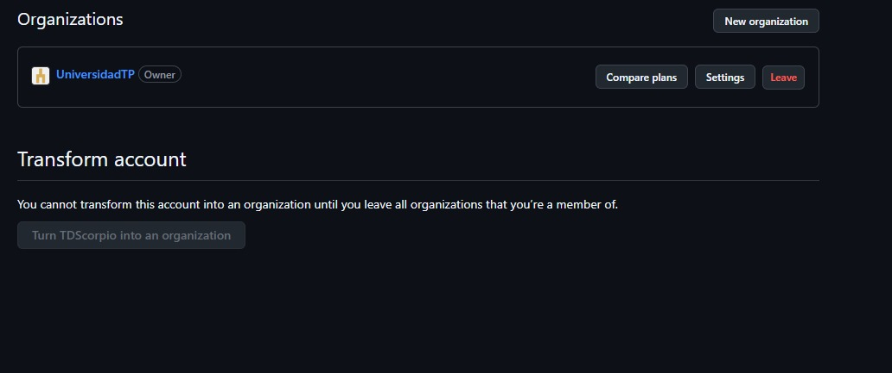
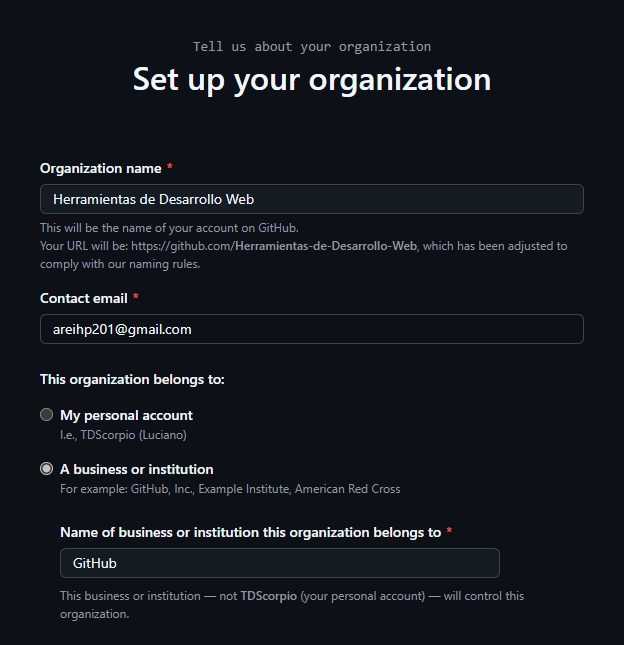
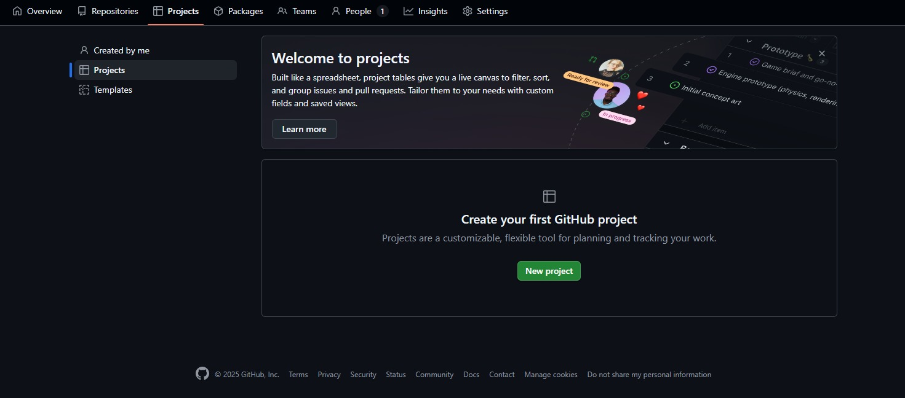
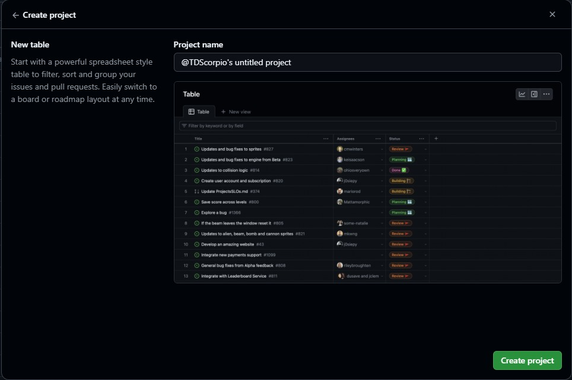
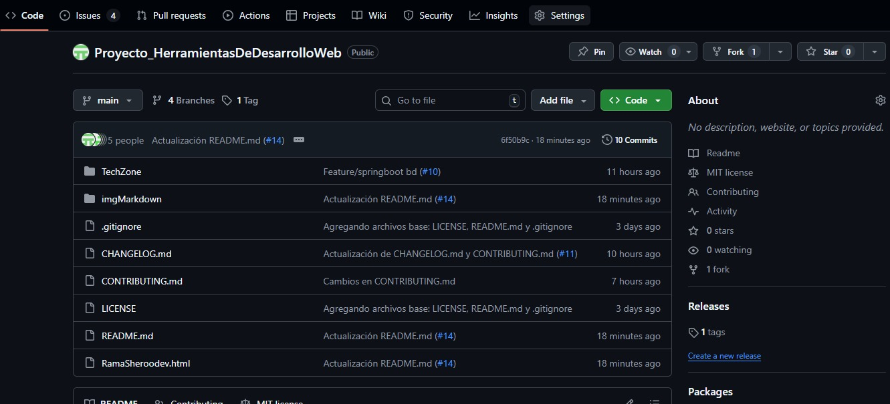
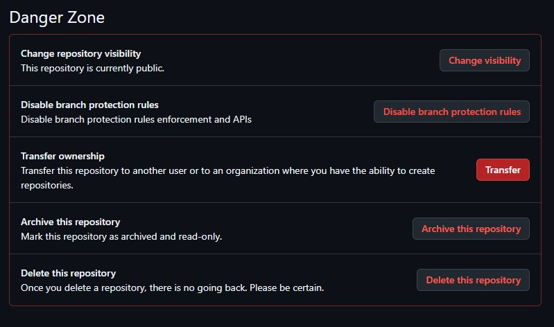
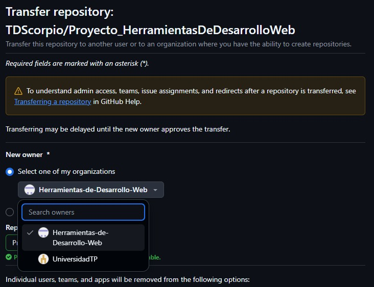
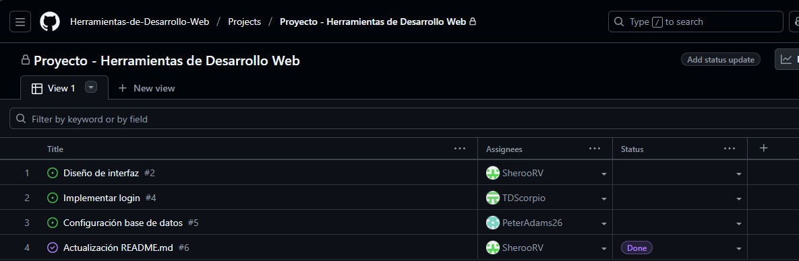
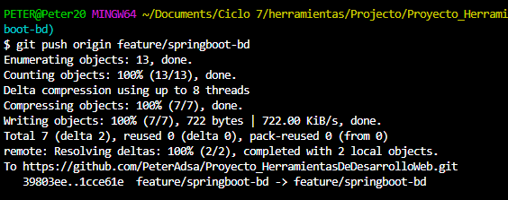

# 1. Desarrollo de un Sistema de Gestión de Ventas para TechZone 🛒

## 1.1. Problematica ⚠️
### La empresa TechZone enfrenta dificultades en la gestión de sus ventas debido a procesos manuales y poco organizados. Actualmente, el registro de clientes, productos y transacciones se realiza en hojas de cálculo y documentos físicos, lo que genera errores frecuentes, duplicidad de información y pérdida de tiempo en la atención al cliente.
### Además, la falta de un sistema centralizado impide un adecuado control de inventario y limita la capacidad de generar reportes en tiempo real para la toma de decisiones estratégicas.

## 1.2. Objetivos 🎯
### 1.2.1. Objetivo General
#### Desarrollar un Sistema de Gestión de Ventas para TechZone que permita automatizar y optimizar el registro de clientes, productos e inventario, mejorando la eficiencia operativa y facilitando la toma de decisiones.

### 1.2.2 Objetivos Especificos. 
* Proporcionar una interfaz amigable que facilite el uso del sistema de TechZone.
* Implementar un flujo de trabajo con Git para llevar control de versiones del sistema durante todo el desarrollo.
* Centralizar el código en GitHub para facilitar la colaboración, respaldo y visibilidad del proyecto.
* Configurar un archivo .gitignore para excluir archivos innecesarios del repositorio.

## 1.3. Requerimientos 📜
|Funcionales|No Funcionales|
|-----------|--------------|
|El sistema debe de ser responsive|Los comandos deberan estar en Git|
|El cliente podra agregar producto al carrito|El README tendra todo el proceso de desarrollo|
|El sistema tendra una ventana de login|Los commits deberán tener mensajes claros y descriptivos|
|El cliente podra actualizar sus datos personales|Se deberán usar pull requests para revisión de código antes de fusionar cambios|
|El sistema tendra un libro de reclamaciones|Los archivos sensibles deberán ser excluidos con `.gitignore`|
|El sistema brindara un resumen de compra al finalizar la venta|Se deberán etiquetar versiones estables con tags en Git|

## 1.4. Tecnologias utilizadas 💻
* java/html/javaScript/css.
* Git/GitHub.
* Visual Studio Code

## 1.5. Instalacion y Ejecucion ▶️
```bash
git clone "enlace URL del remote"
```


## 1.6. Roles y Creditos 👥
|N°|Nombre|Rol|Funciones|
|--|------|---|---------|
|1|Luciano|Git Master|Control de Versiones|
|2|Peter|Dev Backend|Implementacion de APIs|
|3|Sheroo|Dev Frontend|Diseño con CSS|
# 2. Flujo de trabajo GIT
## 2.1. Configuración de identidad
### Comandos
```bash
git config --global user.name "Tu Nombre"
```
```bash
git config --global user.email "tuemail@example.com" 
```


## 2.2. Verificar que la carpeta este creada


## 2.3. Abriendo proyecto desde GitBash
### Crear carpeta del proyecto
```bash
mkdir "Nombre del Proyecto"
```
### Entrar a la carpeta
```bash
cd "Nombre de la carpeta"
```


## 2.4. Inicializando GIT en la carpeta “Proyecto_HDW”
```bash
git init
```


## 2.5. Primer archivo “README.md” referido al primer commit
### Para ingresar texto (echo "") y sea dirigido (>) a README.md
```bash
echo "# TEXTO" > README.md
```
### Agregar el archivo (add.)
```bash
git add. "indica que se agregara"
```
### Realizar el COMMIT
```bash
git commit -m "como se llamara el commit"
```


## 2.6. Agregando “LICENSE” y “.gitignore”
### Agregar LICENSE
```bash
touch LICENSE
```
### Agregar .gitignore
```bash 
touch .gitignore
```
### Verificar si esta o no agregado (add.)
```bash
git status
```


## 2.7. Repositorio local GIT al remoto GitHub
### Conectar al remoto
```bash
git remote add origin "URL del repositorio"
```
### Verificar el vinculo del repositorio
```bash
git remote -v
```


## 2.8. Clases y su commit
### Ver el estado
```bash
git status
```
### Agregar
```bash
git add .
```
### Realizar el segundo COMMIT
```bash
git commit -m "como se llama el commit"
```


## 2.9. Ramas en Git a GitHub
### Crear rama
```bash
git checkout -b "Nombre de la rama"
```
### Volver a la rama principal
```bash
git git switch main
```


### Verificar ramas creadas 
```bash
git branch
```
### Subir ramas a GitHub
```bash
git push --all origin
```


## 2.10. Auditar archivos
### Lista de archivos del proyecto
```bash
git ls-files
```


## 2.11. Viendo commits  y el ID de commits
### ver commit
```bash
git log --oneline
```
### Ver detalle de commit
```bash
git show <ID de commit>
```


## 2.12. Primera version
### Subir al remoto
```bash
git push origin "nombre de la rama"
```
### Subir la version
```bash
git tag -a "numero de version" -m "nombre del commit"
```
### Subir la version
```bash
git push origin "numero de version"
```


## 2.13. Compare & pull request


## 2.14. Ramas fucionada y no fucionadas
### Fucionar ramas
```bash
git pull origin main
```

### Validando ramas 
```bash
git branch --no-merged
```
```bash
git branch --merged
```


## 2.15. Limpiando main para que solo quede LICENSE, README.md y .gitignore
### Guardando todo el código en la rama “backup”
```bash
git push origin backup
```


### Borrando todos los archivos preservando LICENSE, README.md y .gitignore
```bash
git rm -r --cached *
```
```bash
git reset HEAD LICENSE READNME.md .gitignore
```


### Commit y push al GitHub


## 2.16. Eliminando archivos duplicados en otra rama

### Confirmando la eliminacion de los archivos y realizando su commit
```bash
git add -u
```


## 2.17. Conflicto


### Creando archivos para generar conflicto
```bash
git add "archivo"
```
```bash
git commit -m "nombre para commit"
```

### Se visualiza el conflicto


### Solucion de conflicto

### Eliminando rama de prueba para conflicto


## 2.17. Versiones actuales


# 3. Trabajo colaborativo en GitHub
## 3.1. Conectar el repositorio con el GitHub


## 3.2. Creacion de archivos CHANGELOG.md y CONTRIBUTING.md


## 3.3. Configuracion de Branch Rules y Tag Rules
* Protege main (para que solo tú puedas fusionar).
* Exige aprobación de al menos 1 revisor antes de hacer merge.


## 3.3. Regla de protección de sucursales


## 📋 Reglas configuradas en GitHub (Branch & Tag Rules)

| 🔧 Regla | 🧠 Propósito / Por qué se usa | ⏱️ Cuándo se aplica | 🚫 Restricciones o a quién afecta |
|---------|-------------------------------|----------------------|----------------------------------|
| Protección de la rama `main` | Evita que alguien suba cambios directamente al código estable sin revisión previa. | Siempre que se quiera hacer un push o merge hacia `main`. | Solo el líder del proyecto puede hacer merges después de revisión. Colaboradores no pueden hacer push directo. |
| Protección de la rama `develop` | Mantiene una versión estable de desarrollo antes de pasar a `main`. | Cada vez que se integran nuevas features o correcciones. | Todos los colaboradores deben usar Pull Requests. El líder revisa y aprueba. |
| Requerir Pull Request para hacer merge | Garantiza que los cambios sean revisados antes de entrar a una rama protegida. | Cuando un colaborador termina una tarea o funcionalidad. | Todos los colaboradores deben crear PRs; no se permite merge automático sin aprobación. |
| Mínimo 1 revisor obligatorio | Fomenta revisión cruzada y detección temprana de errores. | Antes de aceptar un Pull Request. | Todos los integrantes, incluido el líder, necesitan al menos 1 aprobación. |
| No permitir “force push” | Evita perder historial o sobrescribir commits importantes. | Cuando se intenta hacer `git push --force`. | Nadie puede hacerlo, ni siquiera el líder. Protege la integridad del historial. |
| Requerir ramas actualizadas antes de merge | Asegura que no existan conflictos antes del merge. | Cada vez que un PR está pendiente de revisión. | GitHub bloquea el merge hasta actualizar la rama. Aplica a todos los colaboradores. |
| Requerir status checks (opcional) | Si se usan pruebas automáticas, asegura que pasen antes del merge. | En proyectos con workflows de CI. | Todos los colaboradores deben aprobar los checks antes del merge. |
| Regla de etiquetas (Tag Rules) | Controla el uso de tags de versiones para mantener un historial semántico. | Cada vez que se crea una nueva versión o entrega parcial. | Solo el líder puede crear o eliminar tags oficiales. |
| Bloquear eliminación de ramas protegidas | Impide que alguien borre ramas importantes (`main`, `develop`). | En cualquier momento. | Todos los usuarios, excepto el administrador del repo. |
| Nombrado de ramas | Ordena el trabajo en equipo y evita confusión. | Al crear una nueva rama. | Todos los colaboradores deben seguir el formato: `feature/`, `bugfix/`, `hotfix/`. |


## 3.4. Agregando los Tag 


## 3.5. Prueba de reglas para el correcto funcionamiento.


## 3.6. Creacion de Issues 


## 3.7. Gestion de Issues y Milestones


## 3.8. Asignación de trabajo y prioridad


## 3.9. Creación de Milestones


## 3.10. Agregando Issues a Milestones


## 3.11. Revisar archivos modificados (Líder de grupo)


## 3.12. Creación de una organización


## 3.13. Definiendo Nombre


## 3.14. Vista de la Organización creada


## 3.15. Selección de la forma del proyecto (Kanban)


## 3.16. Seleccionamos tablero Kanban


## 3.17. Tranferir repositorio a la organización


## 3.18. Danger Zone


## 3.19. Confirmación de la transferencia


## 3.20. Vista Final de la Organización


## 3.21. Creación del fork


## 3.22. Vista del fork creado


## 3.23. Clonamos


## 3.24. Agregamos nuestro aporte


## 3.25. Se realiza el commit y el push



## 3.26. Se realiza un PR


# 4. Capturas de Pantallas
## 4.1. Pagina Inicio


## 4.2. Pagina Producto


## 4.3. Pagina Nosotros


## 4.4. Pagina Contacto

